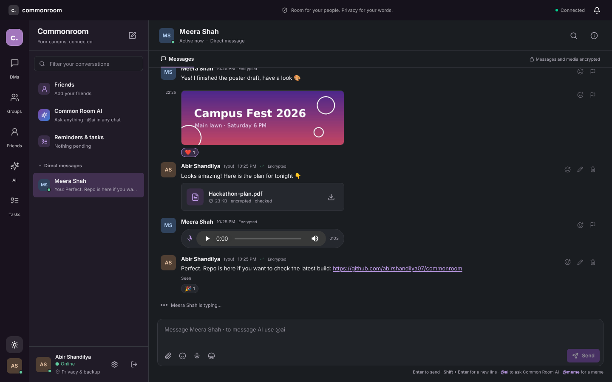
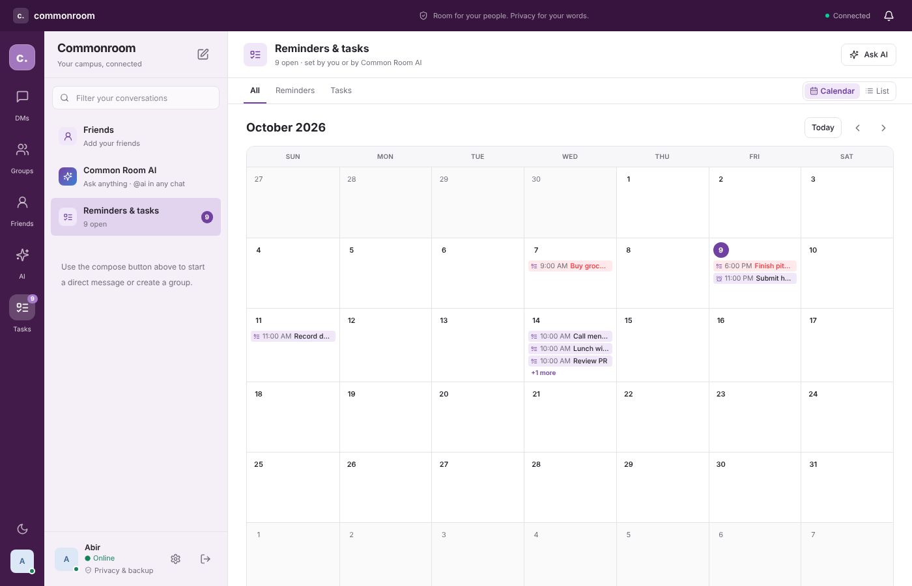
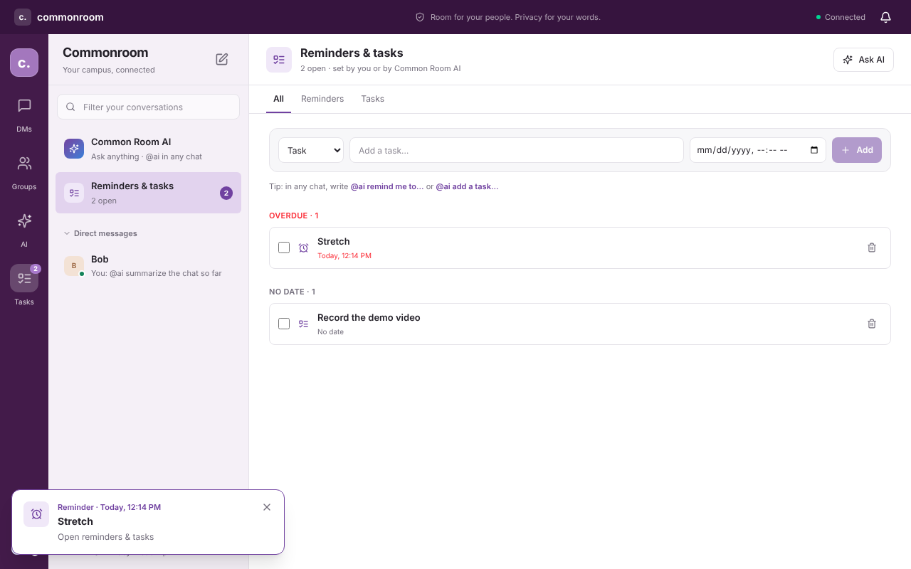
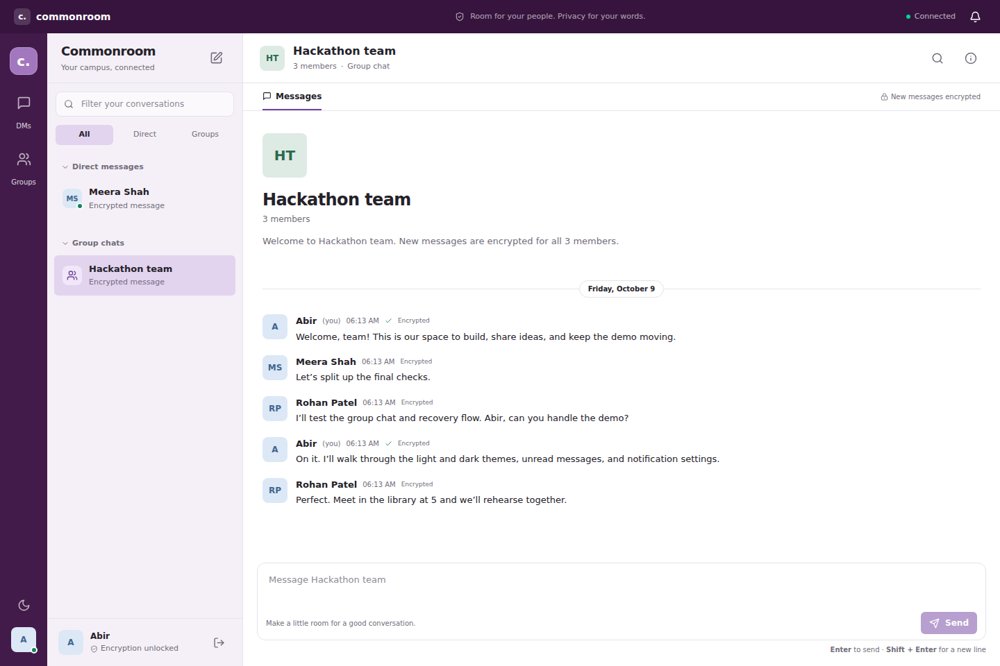
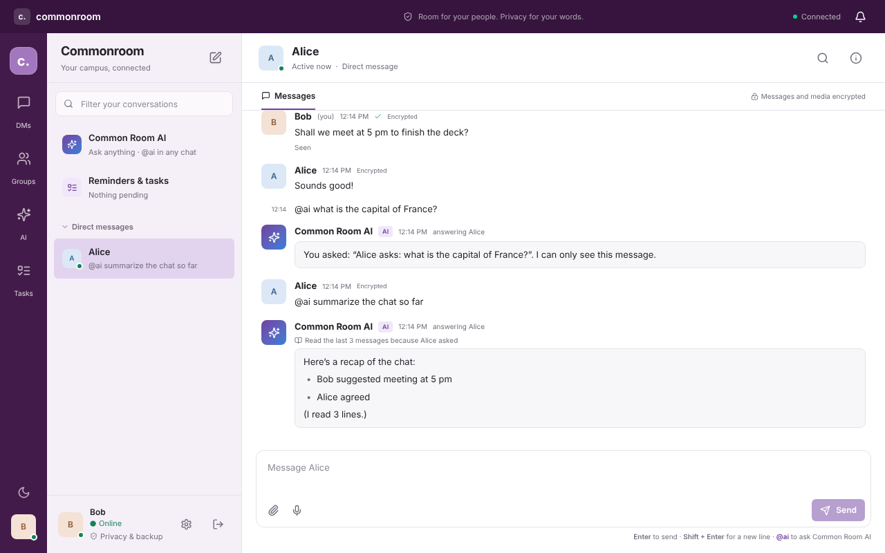
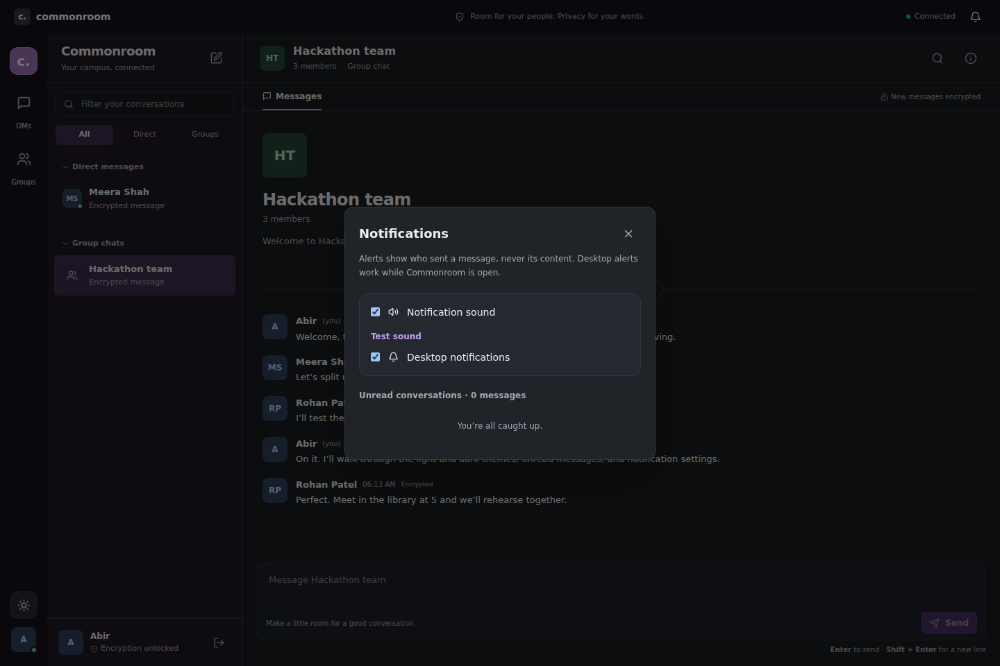
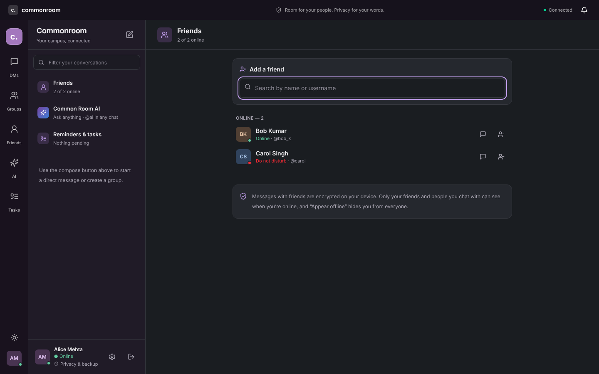
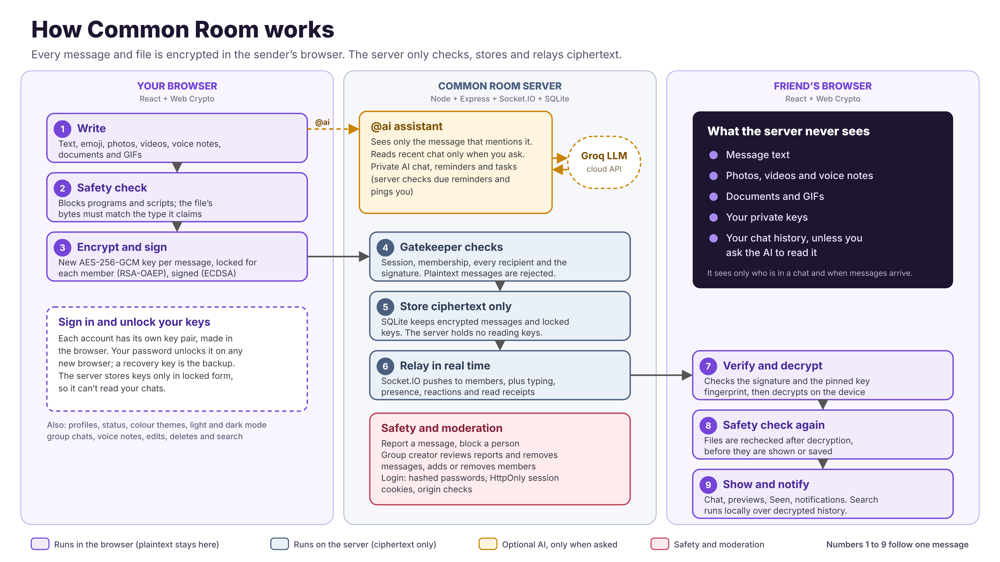

# Common Room

**The campus chat where even our own server can't read your messages, and the AI only listens when you ask.**

Common Room is a real-time chat app for campus students, built by **Team 8 bit Precision** for FIRST COMMIT, IIT Mandi's 24-hour hackathon. Every message, photo, voice note and file is encrypted in your browser before it leaves your device, so the server only ever stores locked data. On top of that sits an AI assistant that respects the same privacy, and a **built-in planner** where you or the AI can set reminders and tasks straight from a conversation and see them on a calendar.

## Try it online

**Live demo: https://commonroom-a8ve.onrender.com**

> **Please read before testing.** The demo runs on Render's free plan:
> - **The first load can take about a minute.** The free server goes to sleep when nobody is using it and wakes up when you open the link.
> - **Data is wiped after about 15 minutes with no visitors.** When the server sleeps, all accounts, messages and uploaded files are deleted, and it starts fresh on the next visit. If your account suddenly no longer exists, that's why: just register again.
>
> Test in one sitting. To try chatting, register two accounts: one in a normal window and one in a private/incognito window (or a different browser).

Running it on your own computer (below) keeps your data permanently.

<p align="center"><a href="#try-it-online"></a></p>

## ⏰ Never miss a deadline: reminders, tasks and calendar

Plans made in a chat usually get lost in the scroll. In Common Room they turn into reminders and tasks in the same place you talk, so students can keep track of assignments, submissions and meetings without a separate app.

<table>
  <tr>
    <td><a href="#-never-miss-a-deadline-reminders-tasks-and-calendar"></a></td>
    <td><a href="#-never-miss-a-deadline-reminders-tasks-and-calendar"></a></td>
  </tr>
</table>

- **Just ask, in any chat.** Type `@ai remind me to submit the deck at 11 pm` or `@ai add a task: record the demo` in a direct message, a group or your private AI chat. The AI creates it, confirms the time in your local time, and asks for a time if you forgot one. You can also say "mark the demo task done".
- **Reminders that actually remind you.** When something is due, a pop-up appears in the app and a "⏰ Reminder" message lands in your private AI chat, even if you set it hours ago from a group chat.
- **A month calendar of everything.** The *Reminders & tasks* tab opens on a calendar. Each day shows what's due, and overdue items are marked in red. Click a day to add a task or reminder for it, and click an item to rename it, move it to another date or time, tick it off or delete it.
- **A list view too.** Switch to *List* to see everything grouped into Overdue, Upcoming, No date and Done.
- **Context kept.** A reminder created from a conversation shows which chat it came from.
- **Tasks with or without a date.** Reminders always need a time; tasks can stay undated until you're ready to schedule them.

## Features

### Private by design
- **End-to-end encrypted direct messages and groups.** Text, edits, photos, videos, voice notes, documents and GIFs are encrypted in the browser (AES-256-GCM with a fresh key each time, wrapped for each member with RSA-OAEP, and signed with ECDSA). The server rejects anything unencrypted and stores only ciphertext.
- **Password unlock on new browsers.** Sign in on any browser and your password unlocks your keys automatically. A downloadable recovery key (in *Privacy & backup*) is the backup if you forget your password.
- **Key fingerprints.** Each person's key is pinned the first time you chat, and the chat is blocked if it changes unexpectedly. You can compare fingerprints in conversation details.
- **Safe file sharing.** The server can't scan encrypted files, so the browser checks them twice: before encrypting and after decrypting. Programs and scripts (.exe, .bat, .js, .html, .svg …) are blocked, files whose bytes don't match their type (an .exe renamed to .pdf) are rejected, and file names are cleaned.

### Chatting
- Direct messages and **groups of 3–256 people**. The group creator can add and remove members; anyone can leave.
- **Photos, videos, voice notes** (record with the mic, up to 5 minutes, with a live level animation) and **documents** (PDF, Word, Excel, PowerPoint, text, CSV, ZIP), up to 25 MB each. Photos and videos show a preview before sending, and videos open in a larger viewer.
- **Reactions, editing and deleting** from the hover toolbar. Edits are re-encrypted and marked "(edited)".
- **Emoji picker** and a **GIF tab** (search GIPHY, or upload your own GIF).
- **Typing indicators**, **"Seen" receipts** ("Seen by …" in groups), and decrypted message previews in the sidebar.
- **Clickable links** in messages.
- **Search**: search the open chat, or *Search all history*, which decrypts and searches your whole history on your own device.
- **Notifications**: unread counts, a notification bell, in-app toasts, and an optional chime and desktop alerts (desktop alerts never show message text).

### People
- **Friends**: search anyone by name or username, send friend requests, accept or decline them, and see your friends listed online first with their status.
- **Profiles**: click a name to see someone's display name, username, join date and status, and keep a private note about them.
- **Status**: Online, Do not disturb (mutes your alerts) or Appear offline, from your name at the bottom left.
- **Settings**: change your display name and profile picture.
- **Moderation**: report a message, block a person (ends the friendship and stops requests both ways), and group creators can remove any message in their group.

### Common Room AI (powered by Groq)
- **Private AI chat**: open *Common Room AI* in the sidebar. Only you see it.
- **@ai in any chat**: write `@ai` in a direct or group message and the answer appears in that chat for everyone.
- **Privacy rule**: by default the AI receives only the message that mentions it. It reads the last 30 messages only when you ask it to ("@ai summarize the chat"). A checkbox above the message box shows which applies before you send.
- **Reminders, tasks and calendar**: see [Never miss a deadline](#-never-miss-a-deadline-reminders-tasks-and-calendar) above.

### Fun
- **Memer**: type `@meme` (or `@meme ProgrammerHumor` for a specific subreddit), or press the laughing-face button, to send a random Reddit meme to the chat. NSFW and spoiler posts are skipped.

### Look and feel
- **Six colour palettes** (Grape, Ocean, Forest, Sunset, Rose, Slate), each with light and dark mode, chosen in your profile settings.
- Show-password toggle on the sign-in and unlock screens.
- Works on desktop and mobile screen sizes.

<table>
  <tr>
    <td><a href="#features"></a></td>
    <td><a href="#features"></a></td>
  </tr>
  <tr>
    <td><a href="#features"></a></td>
    <td><a href="#features"></a></td>
  </tr>
</table>

## How it works

<p align="center"><a href="#how-it-works"></a></p>

The numbers trace one message from the sender's browser, through the server, to the recipient's browser. More detail is in [docs/ARCHITECTURE.md](docs/ARCHITECTURE.md) and [docs/ENCRYPTION.md](docs/ENCRYPTION.md).

| Layer | Choice |
|---|---|
| UI | React 19 + TypeScript + Vite 7, Tailwind CSS 4, Lucide icons |
| Server | Node.js 24, Express 5, JavaScript ES modules |
| Real-time | Socket.IO 4 |
| Storage | SQLite via Node's built-in `node:sqlite` (created automatically) |
| Auth | HTTP-only cookie sessions, scrypt password hashes |
| Encryption | Browser Web Crypto: AES-GCM, RSA-OAEP, ECDSA, PBKDF2 |
| AI | Groq API from the server (Google Gemini as an alternative) |
| Validation and tests | Zod; Node test runner with real HTTP and WebSocket clients |

## Run it on your computer

1. Install **Node.js 24.x** (`node -v` should start with `v24.`).
2. Clone this repository and open the folder in a terminal.
3. Install and start:

   ```bash
   npm ci
   npm run dev
   ```

   On Windows you can double-click `START_WINDOWS.cmd` instead.
4. Open **http://localhost:5173**, create an account, then create a second account in a private window to chat between them.

The app works without any keys. The database is created automatically at `backend/data/commonroom.sqlite`.

### Optional: AI and GIF search

Copy the example settings file and fill in the keys you want:

```bash
cp backend/.env.example backend/.env          # macOS / Linux / Git Bash
Copy-Item backend/.env.example backend/.env   # Windows PowerShell
```

| Variable | What it does |
|---|---|
| `GROQ_API_KEY` | Turns on Common Room AI. Free key at https://console.groq.com/keys |
| `GROQ_MODEL` | Optional Groq model (default `openai/gpt-oss-120b`) |
| `GEMINI_API_KEY` / `GEMINI_MODEL` | Alternative to Groq, used only when `GROQ_API_KEY` is empty |
| `GIPHY_API_KEY` | Turns on GIF search. Free key at https://developers.giphy.com/dashboard/ (uploading a GIF works without it) |
| `PORT` | Backend port (default 3001) |
| `APP_ORIGIN` | Allowed browser origin(s), e.g. `http://localhost:5173` |
| `DATABASE_PATH` | Where the SQLite file lives |
| `COOKIE_SECURE` | `true` when served over HTTPS |
| `TRUST_PROXY` | `1` behind one trusted reverse proxy (e.g. Render) |

Keys stay on the server and never reach the browser. Never commit `backend/.env`; `.gitignore` already excludes it. Restart `npm run dev` after changing it.

### Commands

| Command | Purpose |
|---|---|
| `npm run dev` | Start frontend (:5173) and backend (:3001) together |
| `npm run build` | Type-check and build the frontend |
| `npm start` | Serve the built app from the backend on :3001 |
| `npm test` | Run the backend integration tests |
| `npm run check` | Build and test |

### Deploying (how the demo is hosted)

The demo runs on Render's free plan from this public repository: a Node web service with build command `npm ci && npm run build`, start command `npm start`, and the environment variables `NODE_VERSION=24`, `APP_ORIGIN=https://<your-app>.onrender.com`, `COOKIE_SECURE=true`, `TRUST_PROXY=1`, plus the optional keys above. Static hosts such as Vercel or Netlify can't run it, because the app needs a long-running Node process for WebSockets and SQLite.

## Project structure

```text
frontend/src/
  App.tsx                 # Session restore and main layout
  components/             # Chat, auth, friends, AI panel, calendar, dialogs
  hooks/                  # useChat (sockets), useAssistant, useFriends, useNotifications, useTheme
  lib/                    # API helper, device keys, encryption, file safety, media
backend/src/
  index.js                # Configuration and server start
  app.js                  # HTTP routes and socket handlers
  auth.js  chat.js  db.js # Sessions, membership checks, SQLite schema and migrations
  assistant.js            # Common Room AI, reminders and tasks
  friends.js              # Friend requests
  moderation.js           # Reports, blocks, group-creator removal
  gifs.js  memes.js       # GIPHY and Memer proxies
backend/tests/            # Integration tests
shared/crypto.js          # Encryption protocol shared by browser and server
docs/                     # Architecture, encryption, demo checklist, screenshots
```

## Honest limits

- The encryption is a hackathon prototype and hasn't been independently audited. There is no forward secrecy, so a leaked private key would expose old messages sent to that account.
- The first time you chat with someone you trust the key the server gives you; fingerprint pinning catches later changes.
- The server still sees metadata: who is in which chat, and when messages are sent.
- AI replies, reminders and tasks are stored unencrypted on the server, and whatever you ask the AI is sent to Groq.
- Reactions, profile pictures, display names and private notes are stored readable on the server.
- It runs as one server process with SQLite, which fits a campus demo but isn't built to scale horizontally.

See [docs/ENCRYPTION.md](docs/ENCRYPTION.md) for the full threat model.

## Team

Built by **Team 8 bit Precision** for FIRST COMMIT 2026, IIT Mandi:

- Abir Shandilya
- Aditya Ranjan
- Ojasv Jain
- Lohitaksha Rohila
